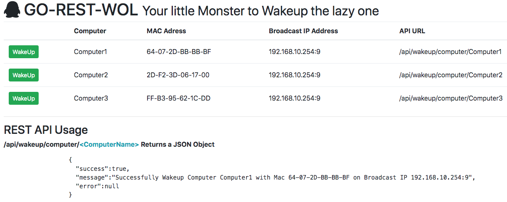

# Go HTTP Server for Remote WOL Requesting from an CSV Computer List

A HTTP Server which sends Wake On Lan Package on an HTTP Request.

### Simple Bootstrap UI for the easy Usage.



### Simple REST API to let a Machine wake someone up

/api/wakeup/computer/**<ComputerName>** -  Returns a JSON Object

```json
{
  "success":true,
  "message":"Magic Packet sent to Computer1 with MAC 64-07-2D-BB-BB-BF on Broadcast IP 192.168.10.254:9",
  "error":null
}
```

## Command Line Arguments

| Commandline Argument | Example          | Description                                                                            |
| -------------------- | ---------------- | -------------------------------------------------------------------------------------- |
| --port               | --port 80        | Define the Port where the Webserver will listen to **(Default: 8080)**                 |
| --file               | --file comp.csv  | Path to the CSV File containing the Computerlist                                       |

## Computer List File CSV layout

### Columns
__&lt;name of the computer&gt;__,__&lt;mac address of the computer&gt;__,__&lt;broadcast ip to send the magic packet&gt;__


### Example
```csv
name,mac,ip
Computer1,64-07-2D-BB-BB-BF,192.168.10.254:9
Computer2,2D-F2-3D-06-17-00,192.168.10.254:9
Computer3,FF-B3-95-62-1C-DD,192.168.10.254:9
```

## Docker
Use supplied docker-compose.yml (adapt port, computer.csv file as necessary) 
```
docker-compose up --build -d
```
Or directly:

```
docker build -t go-rest-wol .
docker run go-rest-wol
```
If you want to run on a different port (i.e.: 6969) and also want to provide the csv file on your host:
```
docker run -p 6969:8080 -v $(pwd)/externall-file-on-host.csv:/app/computer.csv go-rest-wol

```


Was a good exercise to learn golang (and refresh my Docker skills)

Thanks to sabhiram for his library : https://github.com/sabhiram/go-wol 
